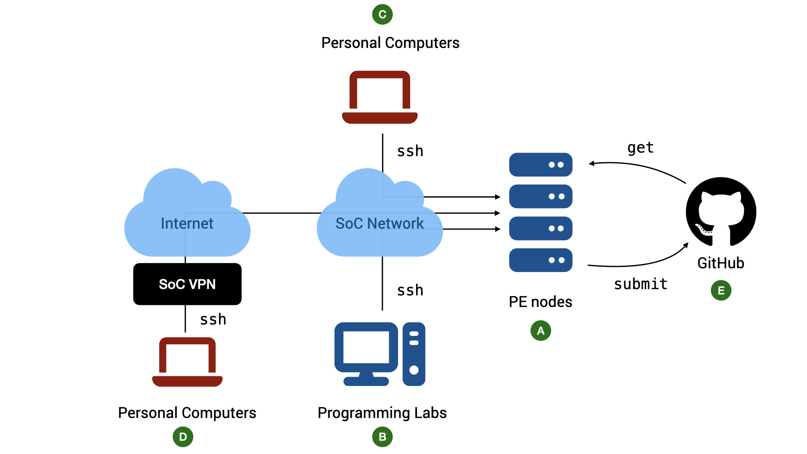

# The CS2030S Programming Environment


<div align="center">Figure 1: The CS2030S Programming Environment.  TL;DR: All work should be done on the PE nodes.  You can access the nodes via `ssh` through lab PCs or your personal devices.  If you need to access them outside SoC, you need to go through SoC VPN.</div>

## Java version

Java is a language that continues to evolve.  A new version is released every six months.  For CS2030S, we will _only_ use Java 21, the most recent version with long-term support.  Specifically, we use `javac 21.0.5` on Ubuntu 20.04.6.

## PE Hosts

The school has provided a list of computing servers with the above environments for you to use (:material-alpha-a-circle: in Figure 1).  The hosts are named `pe111`, `pe112`, ... , `pe118`.  (`pe` stands for "programming environment").  We will refer to these servers generally as the _PE hosts._

!!! note "pe115 and pe116"
    For this semester, two servers `pe115` and `pe116` are not available.

You can choose which of the seven hosts to use.  You share the same home directory across all the hosts (this home directory, however, is different from that of `stu`).  If you notice that one host is crowded, you can use another host to spread out the load.

For simplicity, the following guide uses `pe111` in all examples.  Do keep in mind that you can use other PE hosts for CS2030S to spread out the load.

## Accessing the PE Hosts

While you can complete the programming assignments on your own computers, the practical exams are done in a controlled environment using servers similar to the PE hosts.  It is therefore advisable for you to familiarize yourself with accessing the PE servers via `ssh` and edit your program with either `vim`, `micro` or `emacs` (`vim` is recommended and supported).

### Account

Basic requirements:

1. To access the hosts, you need an SoC Unix account.  If you do not have one, you can [apply for one online](https://mysoc.nus.edu.sg/~newacct/).

2. Once you have an account, you need to [activate your access to the PE hosts](https://mysoc.nus.edu.sg/~myacct/services.cgi), which are part of the SoC computer clusters.

3. To access PE Hosts from your computer (:material-alpha-c-circle: or :material-alpha-d-circle: in Figure 1) you need

    - a command line `ssh` client.  Windows 10/11, macOS, and Linux users should already have `ssh` installed by default.  If your OS does come with `ssh` (i.e., it cannot find the `ssh` command when you type `ssh` into your terminal), look for instructions on how to install OpenSSH client on your operating system.
   - a [terminal emulator](unix-background.md#what-is-a-terminal).  The default terminal emulator that comes with Windows and Mac supports only basic features.  For Windows 10/11 users, CS2030S recommends either PowerShell (pre-installed) or [Windows Terminal](https://apps.microsoft.com/detail/9n0dx20hk701?ocid=webpdpshare).  For macOS users, CS2030S recommends [iTerm2](https://iterm2.com/).

### The Command to SSH

You can access the PE hosts remotely via `ssh` (Secure SHell).

To connect to a remote host, run the following in your terminal on your local computer:
```
ssh <username>@<hostname>
```

Replace `<username>` with your SoC Unix username and `<hostname>` with the name of the host you want to connect to. For instance, I would do:
```
ssh ooiwt@pe112.comp.nus.edu.sg
```

if I want to connect to `pe112.comp.nus.edu.sg`.

After the command above, follow the instructions on the screen.  The first time you ever connect to `pe112.comp.nus.edu.sg`, you will be warned that you are connecting to a previously unknown host.  Answer `yes`.  After that, you will be prompted with your SoC Unix password.  Note that nothing is shown on the screen when your password is being entered.

<script id="asciicast-4rtH1KENV6QOdKtlY0T7mce0M" src="https://asciinema.org/a/4rtH1KENV6QOdKtlY0T7mce0M.js" async></script>

### Accessing The PE Hosts from Outside SoC

The PE hosts can only be accessed from within the School of Computing networks.  If you want to access it from outside, you need to connect through SoC VPN (:material-alpha-d-circle: in Figure 1).

First, you need to set up a Virtual Private Network (VPN) (See [instructions here](https://dochub.comp.nus.edu.sg/cf/guides/network/vpn)).  The staff at the IT helpdesk in COM1, Level 1, will be able to help you with setting up if needed.  You can also contact them via the NUS IT RT system at [https://rt.comp.nus.edu.sg](https://rt.comp.nus.edu.sg).

!!! note "SoC VPN vs NUS VPN"

    Note that SoC VPN is different from NUS VPN.  Connecting to NUS VPN only allows you access to the NUS internal network, but not the SoC internal network.

!!! note "FortiClient VPN vs FortiClient"

    When you setup the SoC VPN client, please make sure that you download and install "FortiClient VPN Only", and not "FortiClient".  The latter is a commercial product that would stop working after the free trial is over.   On the other hand, "FortiClient VPN" is a free product.

### Accessing The PE Hosts from SoC Lab PCs

CS2030A practical exams will be conducted in the programming labs in COM1, COM4, and AS6 using the Ubuntu environment on the lab PCs.  Students are advised to use the lab PCs during regular lab sessions to familiarize themselves with the environment (:material-alpha-b-circle: in Figure 1).  

To access the PE hosts from the lab PCs during lab sessions:

- Boot into Ubuntu if the PC is not already running Ubuntu
- Log into the PC using the SoC Unix account
- Launch the terminal and use `ssh` command above.

!!! warning
    The local home directory on the lab PCs will be cleaned regularly.  _Do not expect that files stored in the lab PCs to be persistent_.  You can copy your files to external drive, to your home directory on the PE hosts, or to a cloud storage.
    
### Troubleshooting SSH Connection

Some common error messages you may receive when you `ssh` and what they mean:

1. > `ssh: Could not resolve hostname pe1xx.comp.nus.edu.sg`

    `ssh` cannot recognize the name `pe1xx`. Likely, you tried to connect to the PE hosts directly from outside of the SoC network.

2. > `Connection closed by 192.168.48.xxx port 22`

    You have connected to the PE host, but you are kicked out because you have no permission to use the host.

    Make sure you have activated your access to "SoC computer clusters" [here](https://mysoc.nus.edu.sg/~myacct/services.cgi).

3. > `Permission denied, please try again`

    You did not enter the correct password or username.  Please use the username and password of your SoC Unix account which you have created [here](https://mysoc.nus.edu.sg/~newacct/).

    Check that you have entered your username correctly.  It is _case-sensitive_.

    If you have lost your password, go here (to reset your password)[https://mysoc.nus.edu.sg/~myacct/resetpass.cgi).

4. > `Could not chdir to home directory /home/o/ooiwt: Permission denied`

    This error means that you have successfully connected to the PE hosts, but you have no access to your home directory. 

    This should not happen.  Please [file a service request with SoC IT Unit](https://rt.comp.nus.edu.sg/). Include the error message, the PE hosts that you connected to, and your username.  The system administrator can reset the permission of your home directory for you.

## Copying Files between PE Nodes and Local Computer

Secure copy, or `scp`, is one way to transfer files between the programming environments and your local computer.  `scp` behaves just like `cp` (see [Unix: Essentials](unix/essentials.md)).  The command takes in two arguments, the source and the destination.  The difference is that we use the `<username>@<hostname>:<filename>` notation to specify a file on a remote host.

Let's say you want to transfer a set of Java files from the directory `ex1` to your local computer.  Then, on the local computer, run:

```bash
ooiwt@macbook:~$ scp ooiwt@pe111.comp.nus.edu.sg:~/ex1/*.java .
```

!!! warning
    If you have files with the same name in the remote directory, the files will be overwritten without warning.  I have lost my code a few times due to `scp`.  

The expression `*.java` is a regular expression that means all files with a filename ending with `.java` (see [Advanced Topics on Unix](unix/advanced.md)).
You can copy specific files as well.  For instance, to copy the file `Hello.java` from your local computer to your `~/ex1` directory:

```bash
ooiwt@macbook:~$ scp Hello.java ooiwt@pe111.comp.nus.edu.sg:~/ex1
```

`scp` supports `-r` (recursive copy) as well.

Note that we always run `scp` on your local computer in the examples above, since the SSH server runs on the PE host.

## Setting up SSH Keys

The next step is not required but is a time-saver and a huge quality-of-life improvement.  _You need to be familiar with basic Unix commands_, including how to copy files to remote hosts (using `scp`) and how to check/change file permissions (using `ls -l` and `chmod`).  If you are still not comfortable with these commands, make sure you play with the [basic Unix commands](unix/essentials.md) first.  You can come back and complete this step later. 

Our goal here is to set up a pair of public/private keys for authentication so that you do not need to type your password every time you log into a PE host.

You can use the following command on your local computer to generate a pair of keys:
```
ssh-keygen -t rsa
```

This command will generate two keys, a private key `id_rsa`, and a public key `id_rsa.pub`.  You will be prompted for a passphrase.  This is the passphrase to protect your private key on your local computer.  You can enter an empty passphrase (at the cost of weaker security) to avoid being prompted for the passphrase whenever you access the private key[^1].
Keep the private key `id_rsa` on your local machine in the hidden `~/.ssh` directory and copy the public key `id_rsa.pub` to your account on PE `pe111`.

There are two methods to do this.  You only need to apply one of them.

### Method 1: Using `ssh-copy-id`

If your local machine has `ssh-copy-id` installed, then, run:

```
ssh-copy-id <username>@pe111.comp.nus.edu.sg
```

You will be prompted to enter your password for the PE host.  After this step is completed, your public key will be copied to and configured for password-less login to the PE hosts.

### Method 2: Using `scp`

First, use `scp` to copy the public key `id_rsa.pub` from your local machine to your home directory on PE `pe111`.

On `pe111`, run

```
cat id_rsa.pub >> ~/.ssh/authorized_keys
```

Make sure that the permission for `.ssh` both on the local machine and on PE is set to `700` and the files `id_rsa` on the local machine and `authorized_keys` on the remote machine are set to `600`.  See the guide on using [`ls`](unix/essentials.md#ls-list-content-of-a-directory) and [`chmod`](unix/essentials.md#file-permission-management) if you are unsure how to do this.

Once set up, you need not enter your password every time you run `ssh` or `scp`.

## Stability of Network Connection
    
Note that a stable network connection is required to use the PE hosts for a long period without interruption.   If you encounter frequent disconnections while working at home or on campus while connected wirelessly, please make sure that your Wi-Fi signal is strong and that there is no interference from other sources. 

If your connection is disconnected in the middle of editing, `vim` saves the state of the buffer for you.  See the section on [recovery files](vim/tips.md#5-recovery-files) on how to recover your files.

If you find yourself facing frequent disconnection, you can consider running [`screen`](https://en.wikipedia.org/wiki/GNU_Screen).  After logging into a PE host, run:

```
screen
```

You will see some messages, press ++enter++ to go to the command prompt. You can now use the PE host as usual. In case you are disconnected (e.g., in the middle of editing), you can log into the same PE host again, and run:

```
screen -r
```

to resume your previous session.

[^1]: Alternatively you can read more about setting up `ssh-agent` with a passphrase for better security.
